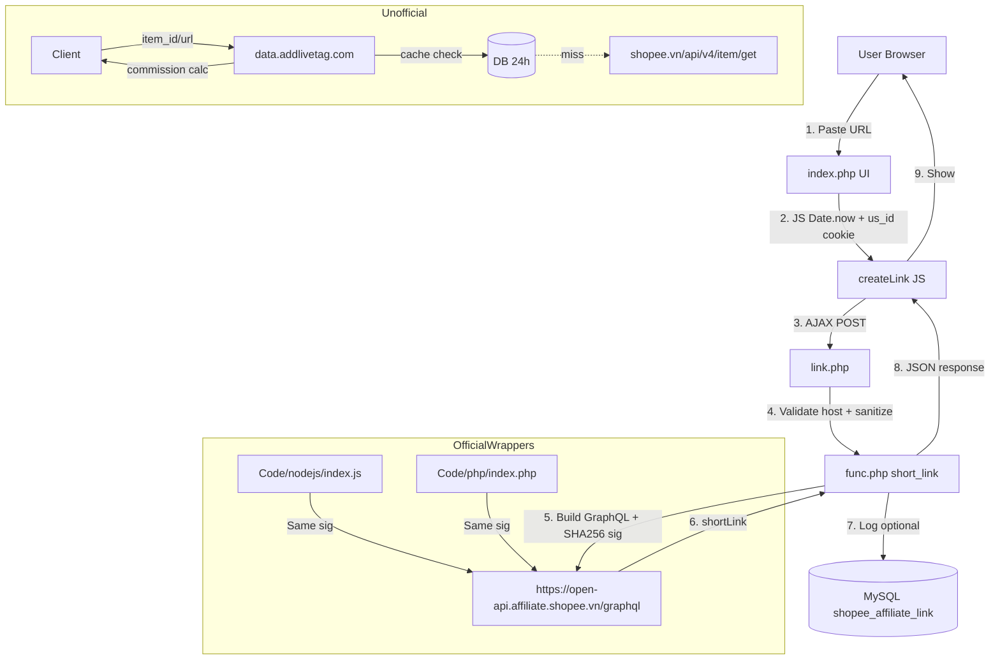
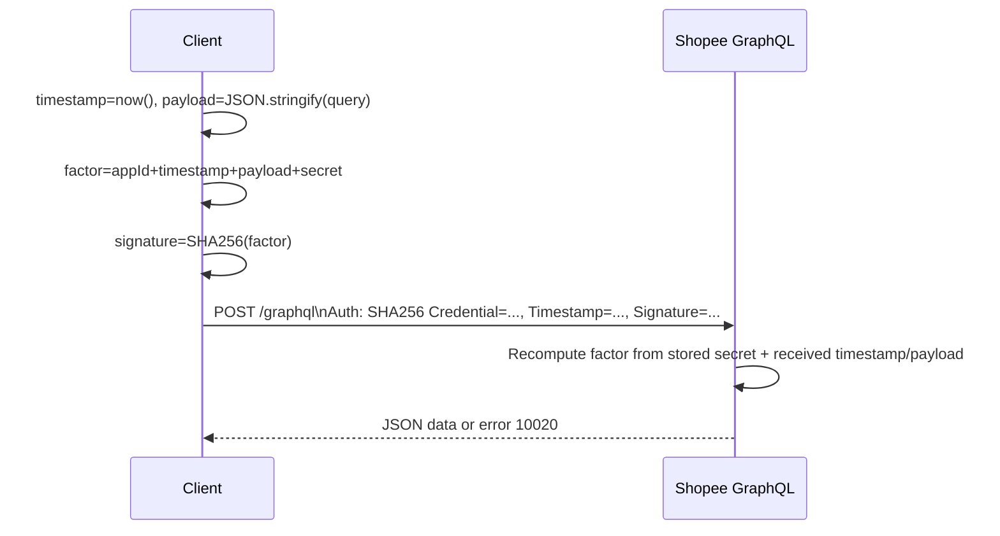

# Reverse Engineering Guide — shopee-aff

> How to systematically reverse engineer, audit, and extend this repository.  
> Designed for engineers who need to understand *why* it works, not just *that* it works.

This guide gives you a repeatable methodology + actual findings for this repo, so you can go from zero to confident contributor in <30 minutes.

---

## 0. What this repo actually is (RE summary)

After static + dynamic analysis, this repo breaks into **3 logical systems**:

```
shopee-aff/
├── 1. Official API Wrappers  (Code/php, Code/nodejs)
│   └── GraphQL -> https://open-api.affiliate.shopee.vn/graphql
│   └── Auth: SHA256(appId + timestamp + payload + secret)
│
├── 2. Custom Link App        (bc-custom-link/)
│   └── UI: Bootstrap + jQuery -> AJAX -> link.php -> func.php -> Shopee API
│   └── Optional MySQL logging shopee_affiliate_link table
│
└── 3. Unofficial Product Data API Docs (product-data-api.md + Postman/)
    └── Docs for https://data.addlivetag.com/product-data/product-data.php
    └── Caching layer (24h), rate-limiting, fallback behavior
```

**Total code surface: ~531 LOC PHP/JS** + 2 markdown specs. Very small, very auditable.

### Key trust boundaries found
- `bc-custom-link/link.php`: validates `shopee.` host, sanitizes subIds `[^a-zA-Z0-9_-]`, strips `sp_atk`/`xptdk` trackers
- `func.php:shopee_aff_api()`: No SSRF protection beyond host check in caller. Timeout 30s.
- `conn.php`: DB optional, fails open if empty credentials.
- All secrets loaded from `.env` — but `bc-custom-link` hardcodes `demo` -> empty strings in demo mode (line 50-51 intended for you to replace).

---

## 1. The 6-Phase Reverse Engineering Method

Use this for **any** repo, demonstrated here.

### Phase 1: Reconnaissance (5 min)

**Goal: inventory without executing.**

```bash
# 1. File type inventory
find . -type f | grep -Ev ".git/|assets/" | sort

# 2. LOC + language breakdown
wc -l $(find . -name "*.php" -o -name "*.js" -o -name "*.json" | grep -v node_modules)
tokei .  # if installed

# 3. Secrets / config hunt
grep -R "API\|SECRET\|Authorization\|.env\|Credential" --include="*.php" --include="*.js" --include="*.md" -n

# 4. Entry points
grep -R "index.php\|index.js\|main\|export function" Code/ -n
ls -la bc-custom-link/*.php

# 5. External dependencies / network
grep -R "curl_\|fetch\|https://\|http://" --include="*.php" --include="*.js" -n | cut -d: -f1-3 | sort -u
```

**Finding for this repo:**
- No `composer.json`, no `node_modules` — zero dependencies (only `crypto`, `fs`, `path` built-ins).
- Only outbound host: `open-api.affiliate.shopee.vn` and `data.addlivetag.com`
- All 3 PHP files in bc-custom-link share state via `require_once`.

### Phase 2: Static Analysis — Read Bottom-Up

Always start from leaf functions, not UI.

**Order that works here:**

1. `bc-custom-link/conn.php` (16 LOC) -> DB optional, easy
2. `bc-custom-link/func.php` (159 LOC) -> core logic
3. `bc-custom-link/link.php` (73 LOC) -> controller / validation
4. `bc-custom-link/index.php` (232 LOC) -> UI + JS glue
5. `Code/nodejs/index.js` & `Code/php/index.php` -> reference implementations
6. `product-data-api.md` -> external unofficial API contract

**Checklist while reading:**

- [ ] For each function: What are inputs? What are side effects? What can fail?
- [ ] For each `$_POST`/`$_GET`/`argv`: Is it sanitized? Where does it flow?
- [ ] For each `curl`/`fetch`: What headers? Timeout? Retry? Error branch?
- [ ] For each `setcookie`/`session`: Secure flags? HttpOnly? SameSite?

**Annotated call graph for `bc-custom-link`:**

```
Browser JS createLink()
  -> $('#customLink_submit').click
  -> $.ajax POST to link.php
     Params: apiAppID='demo', apiSecret='demo', tp='link', link_action='short_link', us_id, url, Sub_id1..5
     
link.php
  -> removeParam(url, 'sp_atk' | 'xptdk')   [func.php:3]
  -> FILTER_VALIDATE_URL + host contains 'shopee.'
  -> sanitizes subIds regex [^a-zA-Z0-9_-]
  -> short_link() 
     -> builds GraphQL mutation: mutation GenerateShortLink($originUrl: String!, $subIds: [String]) { ... }
     -> shopee_aff_api(appId, secret, json_payload)
        -> Signature = SHA256(appId + timestamp + payload + secret)
        -> curl POST https://open-api.affiliate.shopee.vn/graphql
        -> Authorization: SHA256 Credential=..., Timestamp=..., Signature=...
     -> log_shopee_affiliate_link() -> mysqli prepared stmt (safe)
     -> response() -> json_encode {success|errors: {message}}
```

### Phase 3: Dynamic Analysis — Trace a Request

**Method A: Local PHP server + curl**

```bash
cd bc-custom-link
php -S 0.0.0.0:8000

# In another shell, observe
curl -i -X POST http://localhost:8000/link.php \
  -d "tp=link&link_action=short_link&apiAppID=demo&apiSecret=demo&us_id=test123&url=https://shopee.vn/product/38003654/1589295236&Sub_id1=MyTest"

# You will see the demo path: $appDemo=1 -> $apiAppID='' -> Shopee API will error -> reveals error handling
```

**Method B: Node wrapper with MITM / logging**

```bash
cd Code/nodejs
cp .env.example .env
# Edit .env with fake creds to see signature construction
node --inspect index.js shopeeOfferV2 2>&1 | tee trace.log

# Or add console.log of intermediates:
node -e "
import('./index.js').then(m=>{
  console.log(m.buildAuthorization('123','secret','{\"query\":\"{test}\"}', 1712000000))
})
"
```

**Method C: Browser DevTools (for bc-custom-link UI)**

1. Open `index.php` in browser, Open DevTools -> Network tab -> Preserve log
2. Click "Create link"
3. Inspect `link.php` request: Headers, Payload, Response JSON, Timing
4. Breakpoints in `createLink()` JS: watch `isValidShopeeUrl()`, `Sub_id4` (us_id cookie), `Sub_id5` (Date.now())

This proves `Sub_id4` is a fingerprint (md5 of time+rand, stored 1yr cookie), `Sub_id5` is timestamp.

### Phase 4: Crypto & Auth Flow Reverse Engineering

This is the **core** of the repo. Every language does same thing:

**Signature spec from README.md + code:**

```
Timestamp  = time() / floor(Date.now()/1000)   [Unix seconds]
Payload    = JSON.stringify({query: "...GraphQL..."})
Factor     = appId + timestamp + payload + secretKey   [string concat, no delimiter!]
Signature  = hex( SHA256(Factor) )
Header     = "SHA256 Credential=<appId>, Timestamp=<timestamp>, Signature=<signature>"
```

**How to verify you recovered it correctly:**

```js
// Node.js verification - already in index.test.js
import crypto from "crypto"
function test() {
  const appId="123456", secret="secret_key", payload=JSON.stringify({query:"{ shopeeOfferV2 { pageInfo { page } } }"}), ts=1712000000
  const sig = crypto.createHash("sha256").update(`${appId}${ts}${payload}${secret}`).digest("hex")
  console.log(`SHA256 Credential=${appId}, Timestamp=${ts}, Signature=${sig}`)
}
test()
```

**Why this construction is fragile (RE insight):**

- No HMAC, just plain SHA256 concat — vulnerable to length-extension if Shopee used raw SHA256 internally, but they use hex digests, so okay. Still non-standard.
- No delimiter between fields: `appId=12, ts=34, payload="5"` vs `appId=1, ts=23, payload="45"` collide to `"12345"`. Real risk low because payload is JSON with braces.
- Payload order matters: `JSON.stringify` must be identical byte-for-byte. If you pretty-print, signature fails. This explains `JSON_UNESCAPED_SLASHES` in PHP wrapper.

**Error codes to map (from README.md):**

- `10020` invalid signature / timestamp drift >10min?
- `10030` rate limit
- `11000` business error
- Test deliberately with bad timestamp to trigger 10020.

### Phase 5: Data Model & Unofficial API RE

The unofficial API (`data.addlivetag.com`) is **not** in this repo's code — only documented. To RE how it was built:

**Hypothesized architecture from docs:**

```
Client --(item_id or url)--> product-data.php
                               |
                               +-- extracts itemId: regex -i.<shopId>.<itemId>, /product/<shopId>/<itemId>, ?item_id=
                               +-- rate limit: 300 req/min (API), 2000 req/min (DB) per IP (CF + XFF)
                               +-- cache: SELECT WHERE lastUpdate > NOW()-24h => return db
                               +-- else: call Shopee's internal /api/v4/item/get?itemid=... (unofficial)
                               +-- save, compute commission:
                                    sellerComFinal = price * sellerRate * userRate * (1-tax)
                                    shopeeComFinal = min(50000 * userRate, price*0.045) 
                                    commission = sum
                               +-- return JSON with priceStats, latestPriceHistory if db hit
```

**How to RE the unofficial Shopee v4 API yourself:**

```bash
# 1. Open Shopee product in browser, DevTools -> Network, filter "item"
# You'll see calls to https://shopee.vn/api/v4/item/get?itemid=xxx&shopid=yyy
# Copy as cURL, replay

curl 'https://shopee.vn/api/v4/item/get?itemid=1589295236&shopid=38003654' \
  -H 'User-Agent: Mozilla/5.0' \
  -H 'x-api-source: pc' \
  -H 'Referer: https://shopee.vn/'

# 2. Short link expansion (mentioned in product-data-api.md):
curl -Ls -o /dev/null -w '%{url_effective}\n' 'https://s.shopee.vn/4VU2IjQjPF'
# Should redirect to full /product/... URL

# 3. Observe rate limiting headers / Cloudflare
```

This is how `product-data-api.md` author likely discovered commission fields — by inspecting Shopee affiliate dashboard network calls.

### Phase 6: Frontend & Postman Collection RE

**Postman collection deep dive:**

- `Shopee-Product-Data.postman_collection.json`: 3 requests (GET item_id, GET url, POST urlencoded). Variables: base_url, item_id, product_url.
- Good for fuzzing: try `item_id=invalid`, `url=https://evil.com`, `url=https://shopee.vn.evil.com` — see if server validates host (it should).
- Import into Postman / Insomnia / Hoppscotch and run.

**Frontend (bc-custom-link/assets):**

- `theme.min.js` + `theme.min.css` — generic admin theme (likely Looper/Bootstrap 4). Not custom, so skip RE unless bug hunting.
- `custom.css` small overrides.
- jQuery CDN 3.6.0, Popper, Bootstrap 4.1.3 — check for known CVEs (CVE-2020-11022 for jQuery, though 3.6.0 patched).

### Phase 7: Write Your Own RE Lab

Use the provided tools (see `/tools`):

```bash
# Auto-generate call graph + summary
node tools/re-analyzer.js

# Generate mermaid diagram + dependency list
bash tools/re-graph.sh

# Run security quick scan
bash tools/security-scan.sh

# Full trace of crypto path (no real creds needed)
node tools/trace-signature.js --appId 123 --secret test --url https://shopee.vn/product/38003654/1589295236
```

### Phase 8: Document Your Findings

Use this template for each file you RE:

```markdown
## File: func.php
- Purpose: ...
- Exports: short_link(), shopee_aff_api(), ...
- Inputs unsanitized: ...
- Network calls: ...
- DB: ...
- Crypto: ...
- Risks: ...
- Test hook: ...
```

---

## 2. Visual Architecture (Mermaid)



Sequence for auth:



---

## 3. Common Pitfalls When REing This Repo

| Pitfall | Why it happens | How to avoid |
|---|---|---|
| Signature mismatch 10020 | payload whitespace differs | Use exact `json_encode(JSON_UNESCAPED_SLASHES)` in PHP, `JSON.stringify` no pretty in JS |
| Short link expands to HTML not URL | Shopee blocks crawler UA / IP | Use browser UA + follow redirects 15 times, or expand client-side |
| DB logging silently fails | `conn.php` empty creds -> `$connect=null` -> `log_shopee_affiliate_link` returns false | Check `@mysqli_connect` errors, enable `mysqli_report` |
| `us_id` changes every refresh | cookie domain mismatch on localhost/IP | On localhost, host='' so cookie set for current host; use 127.0.0.1 not localhost |
| Rate limit 429 from unofficial API | 300/min per IP global | Cache locally, use item_id not url |

---

## 4. Extension Ideas After RE

- Replace jQuery AJAX with `fetch` + add retry on 429 with exponential backoff
- Add HMAC-SHA256 option in wrappers for safer signature (keep compat toggle)
- Add `tools/expand-url/` microservice for reliable short-link expansion (mentioned as TODO in product-data-api.md)
- Add OpenAPI spec for unofficial API based on docs
- Add unit test for `removeParam` — currently regex vulnerable to param injection with regex metachars (though `preg_quote` helps)
- Add TypeScript types for conversionReport / validatedReport

---

## 5. Reference Commands Cheat Sheet

```bash
# Full repo overview in 1 shot
cat README.md && echo "---" && find . -type f -name "*.php" -o -name "*.js" | xargs ls -lh

# Find all GraphQL queries
grep -R "shopeeOfferV2\|productOfferV2\|generateShortLink\|conversionReport\|validatedReport" --include="*.php" --include="*.js" --include="*.md" -n

# Trace subIds flow
grep -R "Sub_id\|subIds\|sub_id" --include="*.php" --include="*.js" -n

# Security quick audit
grep -R "\$_POST\|\$_GET\|mysqli\|curl\|eval\|base64_decode" --include="*.php" -n

# Test official wrappers without creds (should fail gracefully)
cd Code/nodejs && npm run lint && npm test
cd Code/php && php -l index.php

# Run local bc-custom-link
cd bc-custom-link && php -S 0.0.0.0:8000
# Then open http://localhost:8000 in browser (preview proxy will handle)
```

---

## 6. Tools Included

- `tools/re-analyzer.js` — Parses all PHP/JS, extracts functions, endpoints, secrets patterns, outputs JSON + markdown report to `docs/reverse-engineering/auto-report.md`
- `tools/trace-signature.js` — Interactive tracer for auth flow, no network call
- `tools/security-scan.sh` — Quick grep-based security scanner
- `tools/re-graph.sh` — Generates file dependency list + mermaid

Run `node tools/re-analyzer.js` after any change to refresh mental model.

---

## 7. Legal / Ethical Note

- Official API (`open-api.affiliate.shopee.vn`) requires affiliate account — don't brute force.
- Unofficial API (`shopee.vn/api/v4/...`) is Shopee's internal; respect TOS, rate limits, use caching.
- This guide is for **understanding and interoperability**, not for bypassing commission or scraping at scale.

---

**Maintained as part of this branch `arena/019fe469-shopee-aff`.**  
To add deeper dives, edit `docs/reverse-engineering/` and re-run analyzer.

