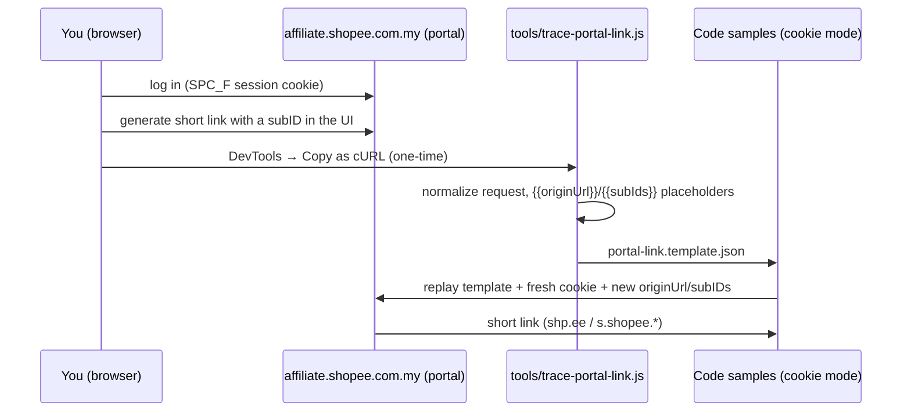

# 06 — Portal Short-Link API (cookie-mode affiliate link generation)

> **The gap this fills:** the official `generateShortLink` GraphQL mutation needs an
> `app_id` + `secret_key`. But the affiliate portal's own browser UI
> (`affiliate.shopee.com.my` → generate short link) can create affiliate links
> **with subIDs** using nothing but your logged-in session cookie. That UI is
> backed by an internal, undocumented web API. This document shows how to
> capture that API with DevTools, turn it into a reusable request template, and
> replay it with the repo's cookie-mode samples — no Open API credentials.

---

## 1. What's in the repo now

| Piece | Path | Purpose |
| --- | --- | --- |
| Capture/replay tool | `tools/trace-portal-link.js` | Parse a DevTools "Copy as cURL" capture → build a template → dry-run / replay it with your cookie |
| Example template | `Code/nodejs/portal-link.template.json` | Request template (placeholder URL until you capture) |
| Node sample support | `Code/nodejs/index.js` | `node index.js shortLink <originUrl> [subId...]` (cookie mode) |
| PHP sample support | `Code/php/index.php` | `php index.php shortLink <originUrl> [subId...]` (cookie mode) |
| Env vars | `Code/*/.env.example` | `SHOPEE_WEB_LINK_TEMPLATE`, `SHOPEE_ORIGIN_URL`, `SHOPEE_SUB_IDS` |

The workflow is **capture once → replay many times**:



---

## 2. Why this works (and what stays official)

- The portal UI is a web app running **in your browser session**. Every action
  it takes — including short-link generation — goes through its own API with
  your `SPC_F` cookie (`COOKIE_AUTH.md` covers cookie auth in general).
- This repo's official Open API docs (`README.md`) and credential mode are
  **unchanged**. Cookie-mode short links are an *additional* path, mirroring
  exactly what the portal UI does.
- **`subIds`:** in the official API, subIDs land in the tracking link's UTM
  content (up to 5). The portal UI sends the same concept through its internal
  API — after capture you'll see the exact field name (often `subIds`,
  `sub_ids`, `subId`, or `utm_content`).

---

## 3. Step 1 — Capture the portal request (2 minutes)

1. Log in to `affiliate.shopee.com.my` in Chrome/Edge/Firefox (cookie must be
   valid; any market domain works — `.com.my`, `.sg`, `.vn`, `.co.id`…).
2. Open **DevTools** → **Network** tab.
3. In the portal UI, generate a short link for any product **and add a
   subID** in the UI (e.g. type a test subID in the tracking field). Keep the
   Network tab open while you click the button.
4. Filter the request list. Candidates to look for:
   - URLs containing `link`, `short`, `shorten`, `shortLink`, `generate`
   - URLs under `/api/` or a GraphQL path (`/graphql`, `/api/graphql`)
   - `Fetch/XHR` type, method `POST`
5. Right-click the request → **Copy** → **Copy as cURL (bash)**.
6. Paste it into the tracer:

```bash
cd shopee-aff
node tools/trace-portal-link.js --capture '<paste the cURL here>' --out portal-link.template.json
```

The tool prints the normalized request and writes the template. It replaces the
product URL in the body with `{{originUrl}}` and a subID array with `{{subIds}}`
automatically; if it can't find them (e.g. the body is a GraphQL query string),
it tells you to swap them in manually.

> **Keep your capture private.** The cURL contains your live session cookie.
> The tool never writes the cookie into the template (`{{cookie}}` placeholder
> instead) and redacts it in output unless you pass `--show-secrets`.

---

## 4. Step 2 — Inspect the template

```bash
cat portal-link.template.json   # or: node tools/trace-portal-link.js --example
```

What to verify:

- **`url`** — the real portal endpoint (per-market; don't share it publicly if
  it's an undocumented internal path).
- **`headers`** — the portal may require extra headers beyond `Cookie`:
  - `X-CSRFToken` / `x-csrftoken` (CSRF for POSTs — already templated)
  - `Origin`, `Referer` (must match the portal domain)
  - Anti-bot headers (e.g. `x-...-sign`, `af-ac-enc-dat`, `X-Sign`) — these are
    **session- or request-scoped**. If they're present, replay may need
    re-capture when they rotate. Keep them in the template verbatim.
- **`body`** — where `{{originUrl}}` and `{{subIds}}` sit.

---

## 5. Step 3 — Dry-run, then replay

Dry-run prints the exact request without sending it:

```bash
node tools/trace-portal-link.js --dry-run --template portal-link.template.json \
  --url 'https://shopee.com.my/product/334425154/8200081234' \
  --subid campaign1 --subid facebook
```

Then replay with your session cookie (env vars, so the cookie never lands in
shell history via args):

```bash
export SHOPEE_COOKIE='SPC_F=...; SPC_EC=...; csrftoken=...'
export SHOPEE_CSRF_TOKEN='...'   # same value as the csrftoken cookie
node tools/trace-portal-link.js --replay --template portal-link.template.json \
  --url 'https://shopee.com.my/product/334425154/8200081234' \
  --subid campaign1 --subid facebook
```

A successful response contains a short link (`shp.ee/...` or `s.shopee.*`).

---

## 6. Step 4 — Wire it into the samples (reusable)

Point the samples at your captured template and drive it from env/CLI:

```env
# Code/nodejs/.env (cookie mode)
SHOPEE_API_APP_ID=
SHOPEE_API_SECRET=
SHOPEE_COOKIE=SPC_F=...; SPC_EC=...; csrftoken=...
SHOPEE_CSRF_TOKEN=...
SHOPEE_WEB_LINK_TEMPLATE=portal-link.template.json
SHOPEE_ORIGIN_URL=https://shopee.com.my/product/334425154/8200081234
SHOPEE_SUB_IDS=campaign1,facebook
```

```bash
# Node
cd Code/nodejs && node index.js shortLink "https://shopee.com.my/product/334425154/8200081234" campaign1 facebook
# PHP
cd Code/php && php index.php shortLink "https://shopee.com.my/product/334425154/8200081234" campaign1 facebook
```

Both pick cookie mode automatically when credentials are empty, and route
`shortLink` to the portal template (up to 5 subIDs, sanitized to `[a-zA-Z0-9_-]`
like `bc-custom-link` does).

---

## 7. Step 5 — Verify the subID is in the link

1. Expand the returned short link and inspect the UTM content:

```bash
curl -Ls -o /dev/null -w '%{url_effective}\n' 'https://shp.ee/abc123'
# look for utm_content=... or sub_id=... carrying your subIDs
```

2. In the portal UI, the "Tracking Link" / short-link list shows the link with
   your subID — confirm it matches.
3. After a purchase, `utmContent` in the official
   `conversionReport` (credential mode) contains the subID, so you can join
   clicks to conversions. Without credentials, use the portal's own report UI.

---

## 8. Automating at scale

- Reuse one template + your cookie; loop products through `shortLink`.
- **Rate-limit yourself.** The portal API is for the interactive UI, not bulk
  automation — stay well under human-click volumes, cache results, and add
  backoff. The unofficial product-data API doc (`product-data-api.md`) warns
  about the same class of problem.
- **Session expiry:** `SPC_F` dies on logout/password change/inactivity. On
  `401/403/redirect-to-login`, re-copy the cookie (`COOKIE_AUTH.md` §7).
- **Anti-bot:** if the portal starts returning CAPTCHA/HTML instead of JSON,
  slow down and consider a browser-driven fallback (the captured request
  itself proves what's needed; you may need to re-capture fresher headers).

---

## 9. Troubleshooting

| Symptom | Likely fix |
| --- | --- |
| Template URL still has `REPLACE_ME` | You haven't captured yet — run `--capture` |
| `403` / redirect to login | Session expired → re-copy `SPC_F` |
| CSRF error on POST | Set `X-CSRFToken` = current `csrftoken` cookie (re-capture if it rotated) |
| Response is HTML / CAPTCHA | Anti-bot triggered → slow down, re-capture headers |
| `404` / `405` | Endpoint path changed per market → re-capture on your market's domain |
| Wrong market data | Cookie and endpoint must match your market domain |
| Body still has a literal product URL | `--capture` couldn't auto-placeholder it → replace manually with `{{originUrl}}` |

---

## 10. Risk & compliance

- The portal web API is **unofficial, undocumented, and not covered by Shopee's
  Open API terms**. It can change, rate-limit, or be blocked at any time.
- A `SPC_F` cookie is a login credential — guard it, rotate it, and never
  commit it (templates use placeholders precisely so secrets stay in env).
- Keep volumes modest and cache aggressively; this is a per-session capability,
  not a bulk pipeline. For anything production-scale, apply for Open API
  credentials (which also unlocks offers, conversion reports, and validated
  reports).

---

See also:

- [`COOKIE_AUTH.md`](../../COOKIE_AUTH.md) — cookie auth fundamentals
- [`tools/trace-portal-link.js`](../../tools/trace-portal-link.js) — the tool (run with `--help`/no args for usage)
- [`03-bc-custom-link-deep-dive.md`](03-bc-custom-link-deep-dive.md) — the credential-mode short-link app this mirrors
- [`02-auth-flow.md`](02-auth-flow.md) — why the official endpoint needs a signature (and cookies can't replace it there)
